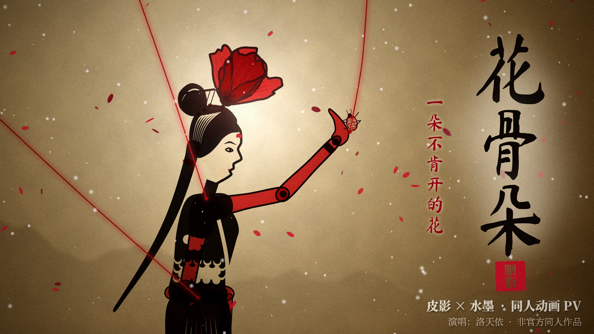

# 花骨朵 · 胭脂影戏 — a fan-made animated PV



A non-official, fan-made animated music video for the song **《花骨朵》**, rendered entirely in code:
every frame is drawn procedurally (vector shadow-puppets, ink-wash brushwork, particles and
post-processing) and timed to the song's beat grid and to each sung syllable.

> The song and its lyrics belong to their rights holders and are **not** included in this
> repository. To render, supply your own copy of the audio and of the LRC file (see below). The
> lyric text is read from that file at render time and is never stored here.

## Art direction — "rouge & ink shadow theatre" (胭脂影戏)

- **The stage is a backlit paper screen.** Everything is composed as light shining through rice
  paper: black carved leather puppets with lace cut-outs, translucent coloured leather that glows
  when backlit, an oil lamp whose position, colour and flicker change with the story. Objects held
  closer to the lamp throw larger, blurrier shadows — the PV uses that real shadow-play physics for
  the ghostly "red self", the lonely shadow on the wall and the puppeteer's hands.
- **Three inks.** Ink black and paper white, plus one narrative colour: cochineal carmine
  (胭脂红). Green appears only once, when spring erupts; winter is cold indigo.
- **An original protagonist, 阿朵.** A flower-bud girl (not a recreation of any existing
  character): a poppy bud (虞美人) crowning her head, a carved hollow face with a red forehead
  mark, and translucent red-leather arms — her ideals — that drain to pale as the story goes on.
- **Typography** in vertical brush calligraphy (马善政楷书 / 志莽行书), revealed character by
  character in sync with the vocal, with red seals (印章) as punctuation.

## Reading of the song (and what I added)

Building on the original PV and the interpretation shared with this project — the bud as a person
whose youth and ideals are pressed into the shape the world wants, told through a feudal bride's
fate, ending in a cycle — the PV adds a few motifs of its own:

- **The red thread.** The red string of a children's cat's-cradle game (翻花绳) becomes the
  red thread of an arranged marriage and finally the strings that hold a puppet. In the climax she
  snaps them one by one.
- **皮囊 / the hide.** Shadow puppets are literally made of hide. When the lyric turns to "this
  skin", the lamp comes close behind her and reveals rivets, rods, and the huge hands working them.
- **Wedding or funeral.** The bride lies in a ring of red poppies *and* white chrysanthemums, the
  funeral flower. The ghostly backdrop of the queue of identical brides is Li Bai's line
  云想衣裳花想容 (public domain), which the lyric inverts.
- **The forgotten.** A family register in which the women are recorded only as "某氏" — each
  name is washed out by ink.
- **Time and work.** Sixteen solar-term seals stamp in from 惊蛰 to 霜降 on the sung syllables;
  the shadow theatre multiplies into an office tower of identical lit windows, day and night
  strobing past. Her childhood self (the red child from the opening) holds out the thread; she
  never looks up.
- **衣鱼 (silverfish) eat paper.** The spring that fed everything feeds her to the silverfish —
  so they eat the picture itself, hole by hole.
- **The cycle.** The opening painting is shown as an old photograph; the ending pulls back from
  the lone flower into the same painting, now crisp and present — and next year's bud appears.

## Structure (≈ 2:50, 1080p30)

| time | section | images |
|---|---|---|
| 0:00 | intro | an old painting paints itself; title seal; cat's cradle; she crosses her red self |
| 0:16 | refrain 1 | drifting over ink mountains; the fork; the palm and the cochineal; release |
| 0:31 | winter | buds fall from a snowy branch; a sun that will not rise; frost; the empty lane |
| 0:47 | the house | a hall slams together on the beat; the curtain; beads; rouge; the queue of brides |
| 1:03 | spring | she tears out through the screen; spring erupts; a bed of flowers; roots; silverfish |
| 1:20 | refrain 2 | a red void; a labyrinth dive; hands crushing cochineal; rouge running like tears |
| 1:35 | the hide | one lamp; the register; the rods revealed; one bed, two dreams |
| 1:51 | work | running; a cage of furniture; solar-term seals; the office tower; the red child fades |
| 2:08 | refrain 3 | snow in June; tearing out the stem; the closing fist; the bud forcing itself open |
| 2:24 | the bloom | headwind; threads snap and the screen cracks; the bloom; back into the painting |
| 2:40 | epilogue | silence; the lamp dims; a new bud; end card |

## Rendering

Requirements: Python 3.10+, `ffmpeg`, and the EGL/GL runtime libraries that `skia-python` links
against (`apt install libegl1 libgl1` on Debian/Ubuntu).

```bash
pip install -r requirements.txt
bash tools/fetch_fonts.sh                 # SIL OFL fonts from Google Fonts -> assets/fonts/
cp /path/to/your/song.mp3   assets/song.mp3
cp /path/to/your/lyrics.lrc assets/lyrics.lrc
python tools/analyze_audio.py             # optional: regenerate data/*.json (beats, syllable times)
python render.py                          # -> out/huaguduo_pv.mp4  (≈20 min on 4 cores)
```

The cover image (`docs/cover.png`, 16:9) is drawn with the same engine:

```bash
python tools/make_cover.py                # -> out/cover.png / out/cover.jpg
```

Previewing while working:

```bash
python preview.py still 12.5 64.3         # full-size stills
python preview.py sheet 0 30 1.0          # contact sheet, one frame per second
python preview.py clip 46 63 0.5          # half-size clip with audio
```

`data/audio_features.json` and `data/char_timing.json` contain only numbers (envelopes, the beat grid
and the estimated time of every sung character); they let the renderer run without librosa.

## Code map

```
pv/core/       frame & compositing, backlit-screen lighting, camera, easing, noise, textures,
               post-processing (glow, grade, grain, old film), audio envelopes, lyric typography
pv/elements/   puppet rig + cast, poppy/chrysanthemum, ink branches, landscape, hands, insects,
               particles, red thread & cat's cradle, effects (splash, seal, frost, cracks, holes)
pv/scenes/     one module per section (s0_intro … s9_bloom) + per-line lyric layout
pv/timeline.py scene order, transitions, lyric overlay
render.py      parallel renderer (segments -> concat -> mux with the song)
```

## Credits

- Fonts: Ma Shan Zheng, Zhi Mang Xing, Liu Jian Mao Cao, Long Cang, Noto Serif SC — SIL Open
  Font License, via Google Fonts (downloaded by `tools/fetch_fonts.sh`, not redistributed here).
- Song 《花骨朵》 (vocal: 洛天依) — all rights to the music and lyrics remain with their owners.
  This is a non-commercial fan work.
